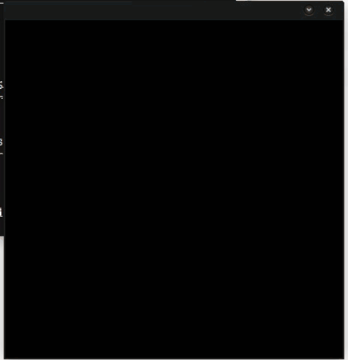

Ant Walking
==========

A ant walking simulation using concepts of randomness at discipline Probability & Statistics

# Python simulation

The python version was wrote using *pygame* for handling the window events, graphics and logic. The coding-style wrote was using Object-Oriented and as more modular as possible. The script whose has the main-loop are: [`simulation.py`](Python/simulation/simulation.py).  The other scripts was spited into: 

* [`automaton.py`](Python/simulation/automaton.py)
    - Our specific entities, as Automaton (base), `Ant` and `Track`
* [`base.py`](Python/simulation/base.py)
    - Abstract class called `Entity` designed to inherit from automaton specific classes
* [`colors.py`](Python/simulation/colors.py) 
    - Some colors constants, like WHITE and BLACK
* [`graphics.py`](Python/simulation/graphics.py)
    - 8bit-like graphics for `Ant` and `Track` (the footprint)
* [`grid.py`](Python/simulation/grid.py)
    - about blocksize and the size of blocks on screen (the size of matrix)
* [`motion.py`](Python/simulation/motion.py)
    - (directions definitions, like `UP`, `DOWN`, `RIGHT` and `LEFT`.
    - All directions definitions are in function of BLOCKSIZE variable in grid.py
* [`main.py`](Python/simulation/main.py)
    - a script helper, only calling the simulation.py `AntSimulation.run()`